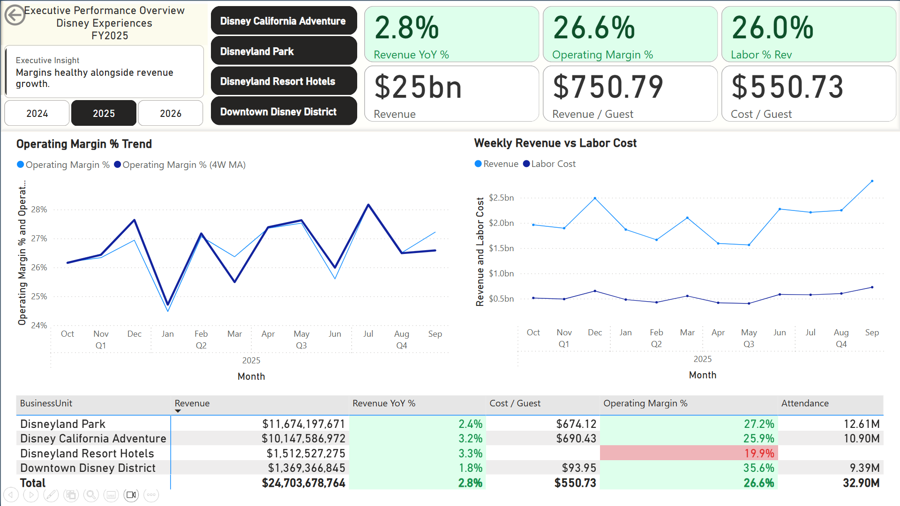
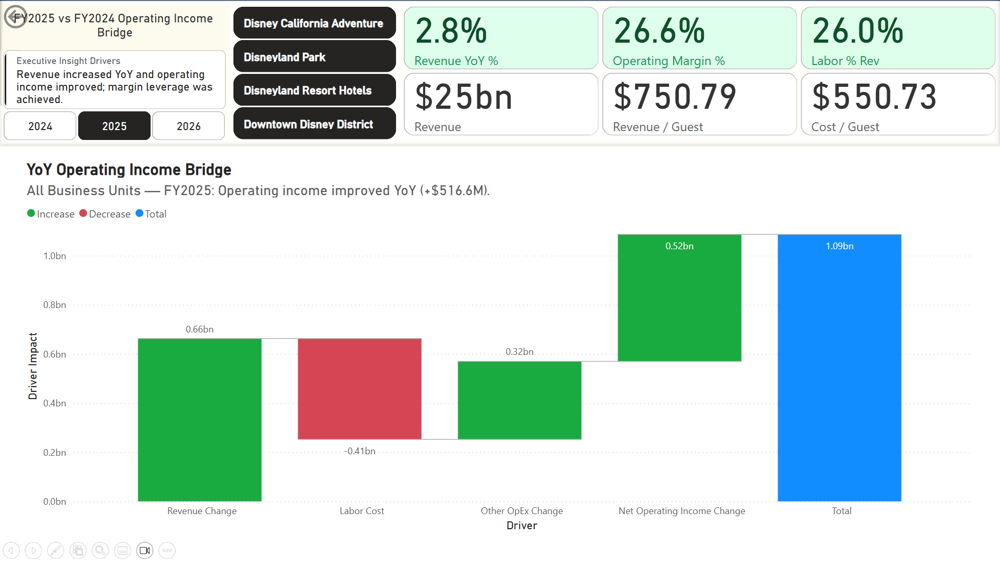
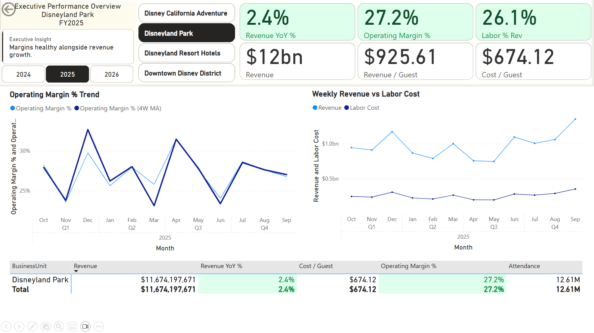
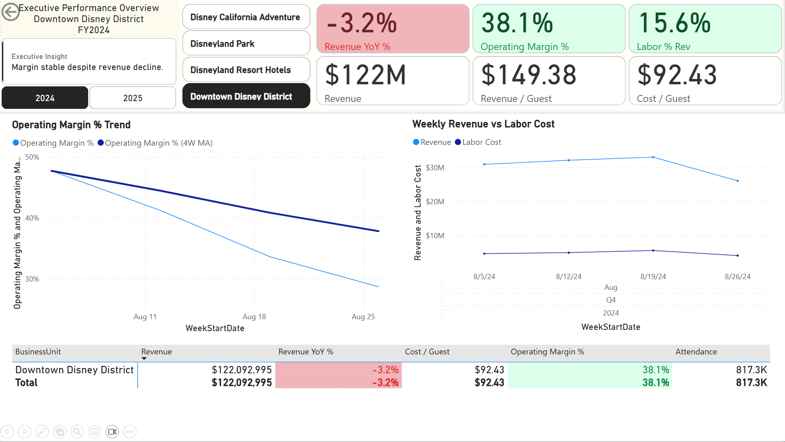

# Disney Experiences Operations Finance Dashboard (Power BI)

An FP&A-style operations finance dashboard analyzing revenue growth, cost structure, and operating income drivers across simulated Disney Experiences business units.

---

*Executive operations dashboard summarizing revenue performance, margin trends, labor efficiency, and guest economics across Disney Experiences business units.* [Download the Power BI Dashboard](https://drive.google.com/file/d/1NWKPss0SH3UA7UJBL51y--UI3HXryy2c/view?usp=sharing) and explore it locally.

---

# Project at a Glance

**Tools Used**
- Power BI Desktop
- DAX
- Star Schema Data Modeling

**Finance Concepts Demonstrated**
- Operations Finance reporting
- Revenue management analytics
- Variance bridge (driver analysis)
- Business unit profitability analysis
- KPI dashboard design

This project simulates how **Disney Experiences FP&A teams monitor operational performance** across theme parks, hotels, and retail operations using executive dashboards and driver-based financial analysis.

---

# Background

The Disney Experiences segment represents one of the most operationally complex and financially significant divisions of The Walt Disney Company, encompassing theme parks, resorts, and hospitality operations. Managing performance across these business units requires continuous monitoring of revenue generation, operating efficiency, and cost structure to understand the underlying drivers of financial performance.

This project simulates an **Operations Finance and Revenue Management reporting workflow**, replicating how FP&A teams monitor business performance and identify operating income drivers across business units.

The dashboard enables real-time analysis of key operational and financial metrics, including:

- Revenue and YoY revenue growth  
- Operating margin and operating income changes  
- Labor cost pressure and labor efficiency  
- Revenue per guest and cost per guest trends  
- Business unit profitability variance  

---

# Executive Summary

Analysis of Disney Experiences performance reveals several key financial trends:

- Total segment revenue reached approximately **$24.7B**, with operating margin stabilizing near **26.6%**, indicating strong profitability despite cost pressures.
- Operating income increased by approximately **+$516.6M year-over-year**, driven primarily by revenue expansion of roughly **+$660M**, partially offset by labor cost increases of approximately **−$410M**.
- Labor costs represented approximately **26% of revenue**, highlighting labor efficiency as a critical operational lever.
- Revenue per guest averaged approximately **$750.79**, while cost per guest averaged approximately **$550.73**.
- Business unit performance varied significantly, with Disneyland Park generating **$11.7B revenue at 27.2% operating margin**.

These findings mirror real-world **Operations Finance workflows**, where finance teams monitor revenue growth sustainability, cost efficiency, and operating income drivers.

---

# Dashboard Pages

## Executive Performance Overview

The Executive Overview dashboard provides a high-level summary of operational performance across Disney Experiences business units.

Key features include:

- KPI cards displaying:
  - Revenue
  - Revenue YoY %
  - Operating Margin %
  - Labor % of Revenue
  - Revenue per Guest
  - Cost per Guest

- Trend visualizations for margin and revenue vs labor cost
- Business unit performance comparison
- Executive insight summaries highlighting key financial narratives

---

## Drivers Deep Dive (Variance Bridge Analysis)

The Drivers Deep Dive page decomposes year-over-year operating income changes using a **variance bridge analysis**.

The waterfall chart isolates major profitability drivers:

- Revenue Change
- Labor Cost Change
- Other Operating Expense Change
- Net Operating Income Change

This analysis shows that **operating income improved by approximately $516.6M YoY**, driven primarily by revenue growth, while labor cost increases partially offset margin expansion.

---

## Business Unit Drilldown — Disneyland Park

Disneyland Park generated approximately **$11.7B in revenue**, with **2.4% YoY growth** and **27.2% operating margin**.

This view highlights:

- Monthly margin volatility
- Revenue vs labor cost trends
- Revenue per guest vs cost per guest economics
- Attendance levels and operational efficiency

The dashboard allows executives to evaluate performance at the business unit level while maintaining visibility into segment-wide financial trends.

---

## Business Unit Contrast Case — Downtown Disney District

Downtown Disney District provides a useful contrast case.

In FY2024:

- Revenue declined **−3.2% YoY**
- Operating margin remained strong at **38.1%**

This demonstrates how cost discipline and operational structure can preserve profitability even when top-line growth slows.

---

# Data Model

The dashboard is built using a **star schema data model**, consistent with enterprise financial reporting systems.

### Fact Table

**Fact_WeeklyOps**

Fields include:

- Fiscal Year  
- Week Start Date  
- Revenue  
- Labor Cost  
- Other Operating Expense  
- Operating Income  
- Attendance  
- Revenue per Guest  
- Cost per Guest  

This table captures operational performance at the **weekly business unit level**.

---

### Dimension Tables

**Dim_Date**

- Date
- Fiscal Year
- Fiscal Quarter
- Fiscal Month

Used for time intelligence and trend analysis.

**Dim_BusinessUnit**

Business units include:

- Disneyland Park
- Disney California Adventure
- Disneyland Resort Hotels
- Downtown Disney District

These dimensions allow the dashboard to support dynamic filtering and performance comparisons.

---

# Key Insights

### Revenue Growth Driving Profitability

Revenue growth contributed approximately **+$660M year-over-year**, representing the largest positive driver of operating income improvement.

---

### Labor Cost Pressure

Labor costs increased approximately **−$410M YoY**, highlighting the importance of labor efficiency in theme park operations.

---

### Strong Park-Level Profitability

Disneyland Park delivered **27.2% operating margin**, reflecting strong operational leverage in high-volume park operations.

---

### Margin Resilience in Retail Segments

Downtown Disney maintained margins near **38–40%**, demonstrating the structural profitability of retail and dining operations.

---

# Technical Implementation

This dashboard was developed using:

- **Power BI Desktop**
- **Star schema data modeling**
- **Advanced DAX measures**, including:

Key calculations include:

- Revenue YoY %
- Operating Margin %
- Labor % of Revenue
- Revenue per Guest
- Cost per Guest
- Operating Income Bridge Analysis

Additional techniques used:

- Time intelligence functions
- Rolling averages (4-week moving averages)
- Dynamic titles and executive insights
- Variance bridge logic using `SWITCH()` measures

---

# Assumptions and Caveats

The dataset used in this project is **synthetic** and designed to simulate a realistic financial reporting environment.

The financial patterns and operational dynamics reflect **plausible theme park economics**, but they do **not represent actual Disney internal financial data**.

The goal of this project is to demonstrate **financial analytics, dashboard design, and executive reporting skills aligned with Operations Finance workflows**.

---

# Connect

GitHub  
https://github.com/Andrew-Pasten  

LinkedIn  
https://www.linkedin.com/in/andrewpastencpp/

Portfolio  
https://andrew-pasten.github.io/Portfolio.io/index.html
